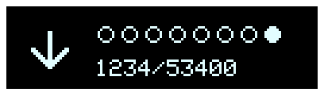

example feather oled
===

simple status view with the feather oled

- arrow indicates flow
- status dots indicate on/off of 8 flags
- quantity complete/total

### resources
- https://rickkas7.github.io/DisplayGenerator/
